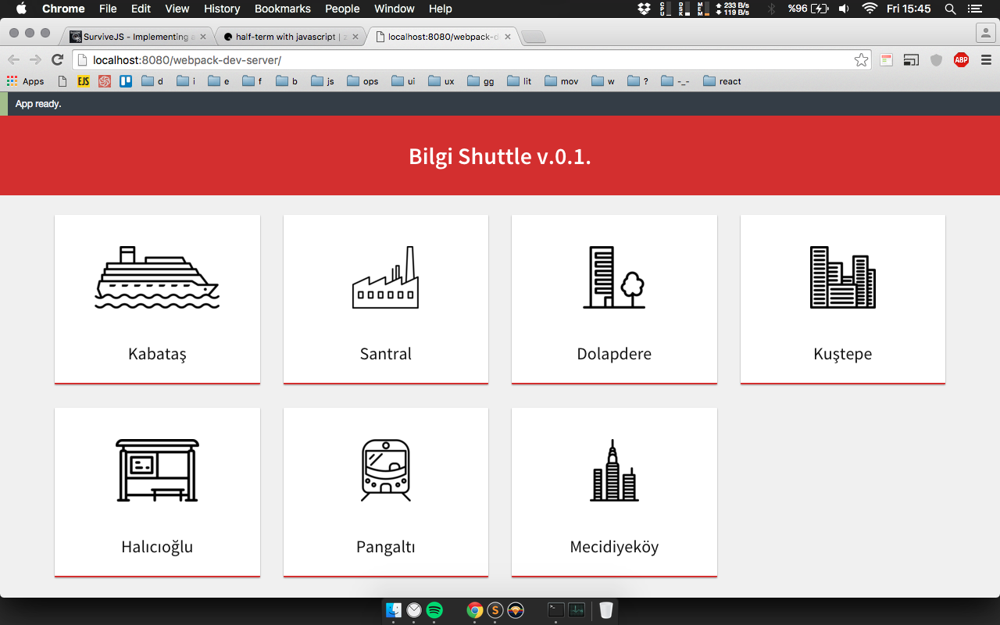
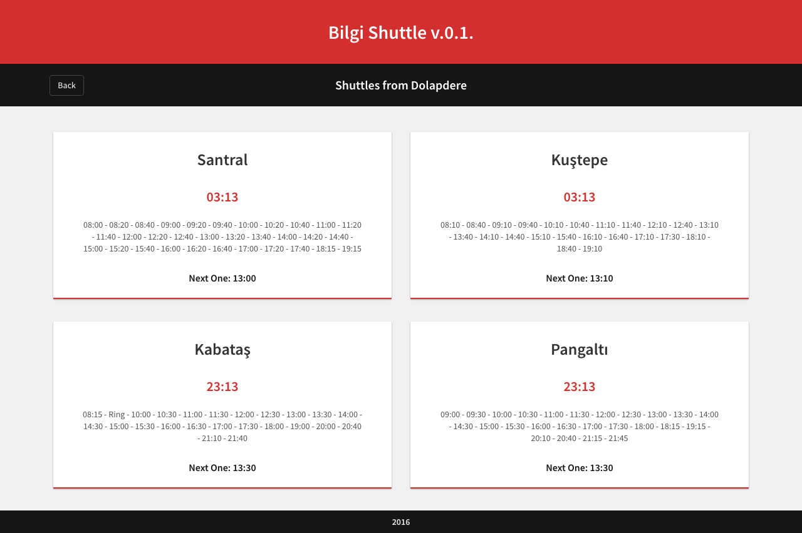

#Bilgi Shuttle Web Application

[]()
[]()

Basic but useful cross-platform application for listing the shuttle routes and times of İstanbul Bilgi University.

Data comes from [bilgi-shuttle-api](https://github.com/bilgishuttle/bilgi-shuttle-api/), processed and shown in this application.

- iOS version: [bilgi-shuttle-ios](https://github.com/bilgishuttle/bilgi-shuttle-ios)
- Android version: [bilgi-shuttle-android](https://github.com/bilgishuttle/bilgi-shuttle-android)

##About
Bilgi Shuttle Web uses

- TypeScript flavored [React](https://facebook.github.io/react/) with [React-Router].

- [Redux](https://github.com/reactjs/redux) as the data layer, with the assistance of libraries like react-router-redux, redux-thunk and redux-logger.

- Polyfill of the native Fetch API, [whatwg-fetch](https://github.com/github/fetch) for async data loading.

- React Bootstrap for styling.

- Karma, Mocha and Chai as the core of testing libraries.

- Enzyme for testing React Components.

- fetch-mock and redux-mock-store for testing Redux Modules.


##Installation
```bash
# Install node (or update if you have an older version, I use v6.2.0 atm)
https://nodejs.org/

# Clone the repository
$ git clone https://github.com/bilgishuttle/bilgi-shuttle-web.git

# Go to app folder
$ cd bilgi-shuttle-web

# Install node_modules and type definitions
$ npm run setup
```

##Usage
```bash
# Start for development
$ npm start

# Application will be served on http://localhost:3000

# Run unit tests
$ npm test

# Build the dist version and copy static files
$ npm run build
```

##Screenshots





##License

	Copyright [2016] [Altay Aydemir]

    Licensed under the Apache License, Version 2.0 (the "License");
    you may not use this file except in compliance with the License.
    You may obtain a copy of the License at

      http://www.apache.org/licenses/LICENSE-2.0

    Unless required by applicable law or agreed to in writing, software
    distributed under the License is distributed on an "AS IS" BASIS,
    WITHOUT WARRANTIES OR CONDITIONS OF ANY KIND, either express or implied.
    See the License for the specific language governing permissions and
    limitations under the License.
